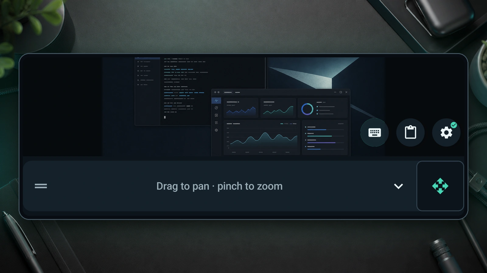
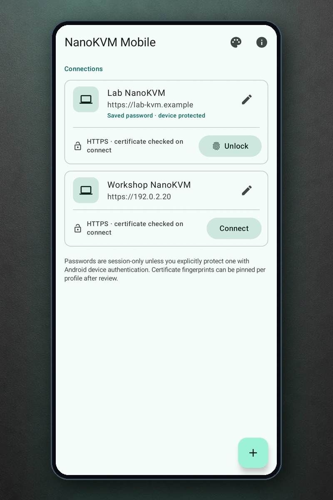
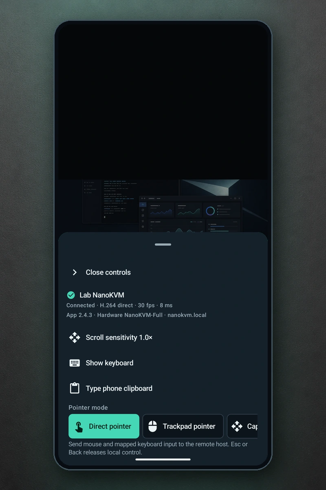
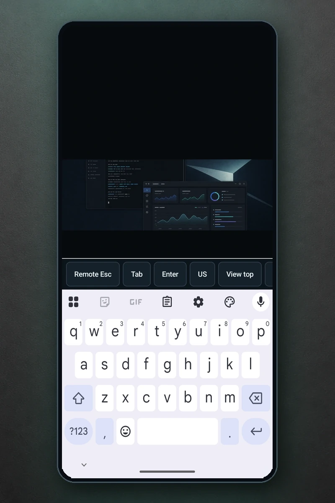

# NanoKVM Mobile

[](LICENSE)

NanoKVM Mobile is an unofficial, open-source Android client for a trusted
[Sipeed NanoKVM](https://github.com/sipeed/NanoKVM). It replaces the cramped
mobile-browser console with direct touch, pan and zoom, Android's native
keyboard, and controls that remain reachable in portrait and landscape.

> [!IMPORTANT]
> This project is independent of Sipeed and is not an official NanoKVM app.
> It controls real keyboard, mouse, reset, and power hardware. Review the
> target device before using guarded actions.



<sub>NanoKVM Mobile 0.3.5 UI captured on an API 37 emulator. The remote desktop,
device frame, and desk backdrop are illustrative generated layers.</sub>

## 0.3.6 signed pre-release candidate

Version **0.3.6** (Android version code **13**) is the project's first
production-signed public pre-release candidate. It is deliberately not labelled
as a stable production release: the compatibility-floor, physical-device,
accessibility, real-appliance, destructive, and endurance gates remain open.
The feature list below describes implemented source; capability-gated features
still need the evidence recorded in the parity ledger before they can be
described as release-verified.

- Saved NanoKVM connections with HTTPS certificate review and pinning.
- NanoKVM login and cookie authentication for application versions 2.3.2+.
- MediaCodec-decoded direct H.264 with automatic MJPEG fallback.
- Optional MJPEG frame-difference detection with a bounded temporary wake when a
  stream starts or falls back.
- Target-aware initial connection recovery and bounded reconnect progress with
  stop, retry, alternate-credential, edit-profile, and disconnect actions.
- Absolute direct-touch, relative trackpad, and external-input capture modes.
- Tap, double-tap, drag, all five mouse buttons, wheel scrolling, Fit and 1:1
  scaling, bounded pinch zoom, and pan.
- Live Android IME input, keyboard-provided voice typing, and a special-key tray
  while keyboard mode is open.
- Explicit, previewed Android clipboard/share-target text typing with target
  layout selection, pacing, cancellation, and reconnect-safe destination binding.
- Opt-in Android Keystore-encrypted passwords unlocked with biometrics or the
  device screen lock on supported Android versions.
- Account-password changes with explicit current/new review, generation binding,
  and optional protected replacement only after the appliance acknowledges it.
- Stream quality, HID reset, Ctrl-Alt-Delete, and guarded power/reset actions.
- Device, firmware, hardware, network, capability, GPIO, RTT, and stream
  diagnostics kept outside the framebuffer.
- Virtual-media image list/mount/eject/delete controls, appliance-side HTTP(S)
  image fetching, virtual USB modes, and Wake-on-LAN history with
  generation-bound confirmations.
- Native appliance administration for updates (including a transient offline
  package picker), reboot, HDMI/OLED/HID, SSH, hostname/mDNS/title, memory/swap,
  DNS, authenticated manual Wi-Fi administration, TLS enablement, and Tailscale.
- Foreground-only system/serial terminals, bounded custom-script management,
  HID shortcut recording, leader-key controls, and autostart script editing.
- An explicit WebRTC-first transport preference with fresh direct-H.264 and
  MJPEG fallbacks, plus an explicitly entered, globally locked PicoClaw control
  surface on supported appliances.
- Restrained Material 3 system/light/dark appearance with optional Android
  dynamic colour; the live console stays neutral so wallpaper colour never
  tints the remote image or status meaning.
- Adaptive phone, landscape, and expanded layouts with bottom-sheet, side, or
  supporting-pane controls, compact phone actions, and a vertically movable
  pan/zoom pad that docks above the keyboard while typing.

The app implements the native side of the NanoKVM 2.4.3 parity roadmap while
retaining a 2.3.2 compatibility floor. Capability gates and retained
verification are tracked in [docs/WEBUI_PARITY.md](docs/WEBUI_PARITY.md); the
trust boundaries and at-most-once mutation rules are in
[docs/SECURITY_MODEL.md](docs/SECURITY_MODEL.md). A code-complete feature is not
claimed as release-verified until its required Android and real-appliance
evidence is attached to that ledger.

## Requirements

- Android 8.0 (API 26) or newer.
- On Android 17 (API 37), allow **Local network** access when prompted. If it is
  denied, connection stays blocked until permission is restored through the
  app's retry or system-settings recovery action.
- A NanoKVM reachable over the local network. Add its device-specific mDNS
  hostname or IP address on first launch.
- NanoKVM application version 2.3.2 or newer.

Private and self-signed certificates are supported through explicit per-device
fingerprint trust. The certificate-inspection probe temporarily accepts the
presented chain only so it can obtain the leaf certificate; it sends no
credential, token, or application request and independently checks hostname and
validity before showing certificate metadata. Application traffic never uses
that inspection client. The app installs no global CA and has no reusable or
global trust-all transport.

The NanoKVM origin, authenticated signaling, and application control traffic
require HTTPS. Initial access-point Wi-Fi setup must be completed through a
trusted NanoKVM setup interface before creating an app profile. Self-signed
appliances remain supported through explicit certificate review and per-profile
pinning. Explicit WebRTC mode may additionally contact appliance-supplied
STUN/STUNS/TURN/TURNS peers during ICE negotiation.

## Install and update

The production-signed **0.3.6** APK is published on the
[v0.3.6 GitHub pre-release page](https://github.com/andrewginns/nanokvm-mobile/releases/tag/v0.3.6).
Download `NanoKVM-Mobile-0.3.6-v13.apk` together with
`NanoKVM-Mobile-0.3.6-v13-SHA256SUMS.txt` and
`NanoKVM-Mobile-0.3.6-v13-signing-certificate-sha256.txt`. The release also
contains the retained `apksigner` verification and machine-readable release
metadata. The expected signing-certificate SHA-256 is:

```text
B8:C5:6C:A6:A2:29:C8:5C:D8:29:DA:21:CF:69:72:19:E2:D1:A1:D5:F9:4D:65:87:19:EB:FA:9E:90:90:75:FD
```

This is the first production signing lineage. It cannot update a development
APK signed with the earlier debug identity. Removing a conflicting development
install erases its app-private profiles, certificate pins, and protected
credentials, so record anything needed to recreate those connections first.

For a local-only development install, build an APK with the current process's
ambient Android debug key:

```powershell
$env:JAVA_HOME = 'C:\Program Files\Android\Android Studio\jbr'
.\gradlew.bat --no-problems-report --dependency-verification=strict :app:assembleDebug
```

The output is `app/build/outputs/apk/debug/app-debug.apk`. Treat that command as
a throwaway local install, not as a shareable update lineage: sandboxed Gradle,
Android Studio, and an interactive shell can select different ambient debug
keys. Android accepts an update only when the application ID and signing
certificate match the installed copy and the new version code is not lower. An
APK built under another account can therefore be rejected as **App not
installed** even when its filename and version name look correct. Do not
uninstall merely to bypass a mismatch without first accepting that app-private
profiles, certificate decisions, and saved credentials will be removed.

Production artifacts must be signed outside the repository with the approved,
stable release identity and pass [the release checklist](docs/RELEASE_CHECKLIST.md).
Never commit a signing key or its credentials.

For an in-place update of a previously shared development build, use the
fail-closed local builder and supply the preceding APK:

```powershell
powershell.exe -NoProfile -ExecutionPolicy Bypass `
    -File .\scripts\build-development-update.ps1 `
    -PreviousApk 'C:\path\to\actual-previous.apk' `
    -KeystorePath "$env:USERPROFILE\.android\debug.keystore"
```

The predecessor is not stored in the repository: supply the actual APK that was
previously installed or shared. The builder selects a keystore only from its
explicit argument, `NANOKVM_DEVELOPMENT_KEYSTORE`, or the current Windows
account's `.android` directory, and rejects any keystore path inside the
repository. It then rejects a package mismatch, a different signer, a version
code that does not increase, or an attempt to replace an existing versioned
output with different bytes. The key remains outside the repository.

## Find your way around

1. On the connection catalogue, use **Add a NanoKVM profile** to enter the
   hostname or IP address, HTTPS port, and username. The top actions also provide
   **Appearance** and **About and open-source licence**. Complete initial
   access-point Wi-Fi setup through a trusted NanoKVM setup interface first.
2. Choose **Connect**, review an untrusted private certificate if prompted, then
   enter the NanoKVM password. Password saving is a separate opt-in choice.
3. On the console, the floating actions provide **Show keyboard**, **Type phone
   clipboard**, and **Open console controls**.
4. **Open console controls** contains scroll sensitivity, Direct, Trackpad, and
   Capture input modes, the view pad toggle, Middle/Back/Forward mouse actions,
   Fit and 1:1 view actions, Video, Power, and More actions.
5. **More actions** contains reconnect and HID reset, **Device details**,
   **Virtual media**, **Wake-on-LAN**, **Administration**, **Operator tools**,
   **Shortcuts & autostart** when available, **PicoClaw (optional)**, full screen,
   and disconnect.

### Interface tour

<table>
  <tr>
    <td width="50%" align="center">
      <a href="docs/images/readme/connections-light.webp"></a><br>
      <strong>Trusted connections</strong><br>
      <sub>Saved profiles with HTTPS and per-device certificate protection.</sub>
    </td>
    <td width="50%" align="center">
      <a href="docs/images/readme/console-controls-portrait.webp"></a><br>
      <strong>Reachable controls</strong><br>
      <sub>Connection health, input modes, clipboard, keyboard, and scroll settings.</sub>
    </td>
  </tr>
  <tr>
    <td colspan="2" align="center">
      <a href="docs/images/readme/console-keyboard-portrait.webp"></a><br>
      <strong>Native keyboard</strong><br>
      <sub>Android IME input with a remote special-key accessory tray.</sub>
    </td>
  </tr>
</table>

<sub>App UI reflects NanoKVM Mobile 0.3.5 and was captured on API 37 emulators;
the standard keyboard state was recaptured from version code 12. The remote
displays, device frames, and desk backdrops are illustrative generated fixtures;
no generated UI substitutes for the app or Android keyboard.</sub>

## Known limitations

- The compatibility floor is NanoKVM application 2.3.2. Later-version,
  hardware-dependent, and extension features are capability-gated and may be
  disabled, read-only, or unavailable on a particular appliance.
- **Auto** video uses direct H.264 and then MJPEG. WebRTC is tried first only
  when **WebRTC** is explicitly selected; it needs compatible native/hardware
  H.264 support and may contact ICE/STUN/TURN endpoints supplied by the trusted
  NanoKVM before falling back to fresh direct-H.264 and MJPEG attempts.
- Phone clipboard and Android share-target text is typed as USB HID input into
  the currently focused remote field. It is not a shared or bidirectional host
  clipboard. A paste is limited to 1,024 UTF-8 bytes and the target mapping is
  US or UK. Clipboard paste rejects unmappable text before typing; live IME text
  can report and omit characters unavailable in the selected mapping.
- Horizontal scrolling is implemented as Shift+wheel because NanoKVM exposes
  one wheel axis, so behavior depends on the remote operating system and app.
- A virtual-media URL tells the appliance to fetch an HTTP(S) `.iso` or `.img`;
  it is not a download to the phone. NanoKVM 2.4.3 exposes no stable transfer
  cancel or checksum contract.
- Root terminal, serial, scripts, updates, network changes, power controls, and
  PicoClaw can disrupt the appliance or controlled host. They require deliberate
  entry and the confirmations shown by the app.
- The current parity implementation has extensive source and API 37 emulator
  coverage, but the compatibility-floor, physical-device, accessibility,
  destructive, endurance, and signed-candidate matrices remain open where the
  ledger says so.

## Build

The repository includes the Gradle wrapper. Use Android Studio's bundled JDK 21
(or another supported JDK 21) and Android SDK platform 37. Java/Kotlin bytecode
targets version 17. Dependency verification is strict and must not be disabled:

```powershell
$env:JAVA_HOME = 'C:\Program Files\Android\Android Studio\jbr'
.\gradlew.bat --no-problems-report --dependency-verification=strict test lintRelease assembleRelease bundleRelease assembleBenchmark :app:verifyReleaseProfiles :macrobenchmark:assembleBenchmark :app:verifyReproducibleSbomMetadata
```

Hosted continuous-integration builds are intentionally disabled while the app
is under active development. Maintainers run this validation locally before
publishing source changes; the retained evidence and wider device-test commands
are documented in [docs/BUILD_VERIFICATION.md](docs/BUILD_VERIFICATION.md).

This produces an unsigned, minified release candidate. It is not a publishable
release until the signing, device, accessibility, appliance, and distribution
gates in [docs/RELEASE_CHECKLIST.md](docs/RELEASE_CHECKLIST.md) pass. Profile
regeneration and performance commands are documented in
[docs/BUILD_VERIFICATION.md](docs/BUILD_VERIFICATION.md).

## Controls

| Gesture/control | Direct-touch mode | Trackpad mode |
| --- | --- | --- |
| One-finger tap | Left click at the touched remote pixel | Left click |
| One-finger drag | Hold left button and drag | Move pointer |
| Double tap | Remote double-click | Remote double-click |
| Long press | Right click | Right click |
| Two-finger vertical drag on the remote preview | Wheel scroll | Wheel scroll |
| Drag on the pan/zoom pad | Pan the local viewport | Pan the local viewport |
| Pinch on the pan/zoom pad | Zoom the local viewport | Zoom the local viewport |
| Drag on the dedicated scroll rail | Scroll remote content up, down, left, or right | Scroll remote content up, down, left, or right |

The keyboard action opens the installed Android keyboard and, while keyboard
mode is visible, an accessory tray for Escape, Tab, Enter, Backspace, Delete,
modifiers, arrows, viewport positioning, function keys, and Ctrl-Alt-Delete.
Voice typing remains available when the installed keyboard enables it. NanoKVM
Mobile does not request microphone permission or receive voice audio; dictation
and personalization follow that keyboard's own permissions and privacy settings.
Committed supported text is translated to USB HID reports; composing text
remains local until committed.

The separate pan/zoom pad floats over the full-height stream. Drag its left
handle vertically (or tap the handle to cycle bottom, middle, and top) to expose
the part of the remote screen needed for the current task. Opening the Android
keyboard temporarily places the pad directly above it; closing the keyboard
restores the previous position. Separate keyboard, phone-clipboard, and console
controls actions follow above or below the pad, leaving the pan/scroll strip full
width; they remain available as floating actions when the pad is hidden. On
compact phones these actions are 48 dp icon buttons so they do not cover the
view controls; wider layouts restore their text labels.

The dedicated four-direction scroll rail sits immediately to the right of the
view-controls caret. Adjust it from **Open console controls > Scroll
sensitivity** between 0.5x and 3.0x. Up and down use the NanoKVM mouse-wheel
axis; left and right use Shift+wheel compatibility and therefore depend on
support in the remote app. The same controls surface provides one-shot Middle,
Back, and Forward mouse actions; tap/drag and long press provide Left and Right.

Physical keyboards and external mice are also routed to the remote host while
the connected console is foregrounded. Direct mode maps an external pointer to
the remote framebuffer; Trackpad mode sends relative movement. **Capture input**
requests Android pointer capture for an external mouse and routes relative mouse
movement plus mapped hardware keys. Escape or Back releases capture locally and
is not sent to the host; capture also ends when the keyboard opens, the input
mode or session changes, or the app loses focus. If Android cannot grant pointer
capture, Direct and Trackpad remain available. Support for special hardware keys
and host handling of mouse buttons four/five still varies by Android device,
NanoKVM firmware, and remote operating system.

Saving a password is always opt-in. The encrypted replacement is committed only
after the NanoKVM accepts it, and unlocking it requires Android's system device
authentication prompt. Cancelling that prompt falls back to ordinary password
entry. An authentication prompt survives screen rotation without retaining the
old Activity or exposing the password to the replacement UI.

## Project layout

- `app/` – Compose UI, profile storage, gestures, IME bridge, and orchestration.
- `protocol/` – authentication, REST/WebSocket models, TLS policy, HID, optional
  feature APIs, and terminal transports.
- `video/` – WebRTC, direct H.264, and MJPEG lifecycles with Android rendering.
- `macrobenchmark/` – Baseline/Startup Profile generation and out-of-process
  release-like performance tests; it is not shipped in the app.
- `docs/` – architecture, protocol, security, testing, and distribution notes.

## Contributing and license

Issues and pull requests are welcome; see [CONTRIBUTING.md](CONTRIBUTING.md).
User-visible milestone and upgrade changes are recorded in
[CHANGELOG.md](CHANGELOG.md).
NanoKVM Mobile is licensed under the GNU General Public License v3.0 or later.
See [LICENSE](LICENSE). Release composition and corresponding-source
requirements are documented in [docs/DISTRIBUTION.md](docs/DISTRIBUTION.md).
