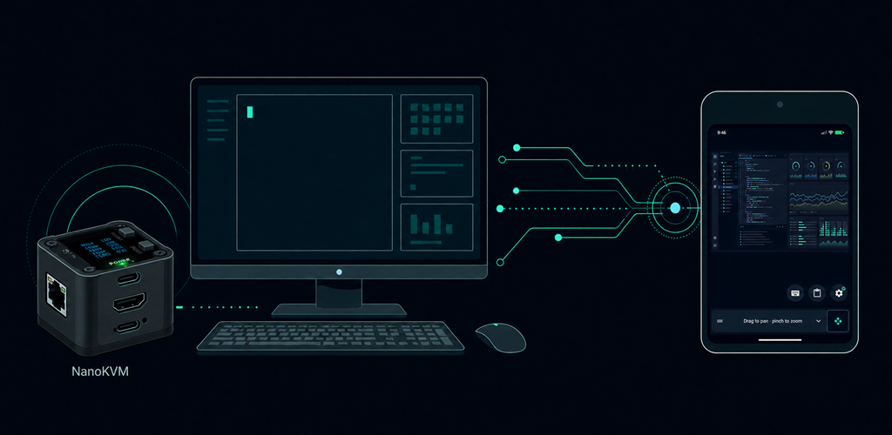
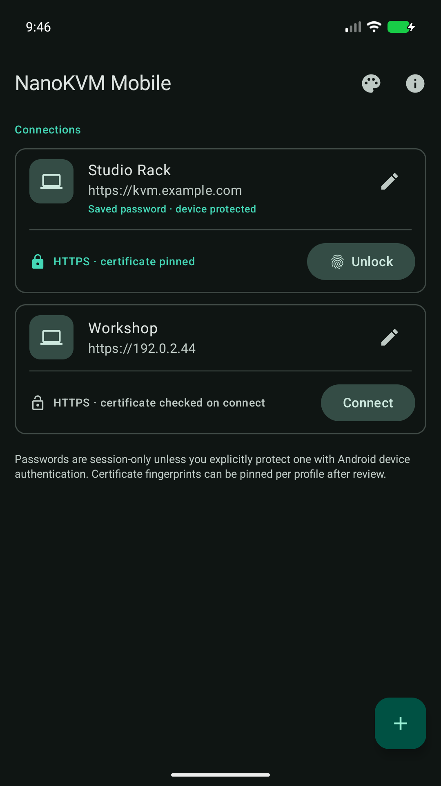
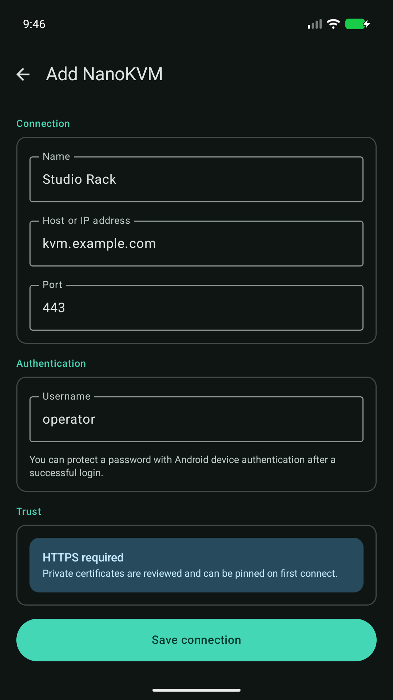
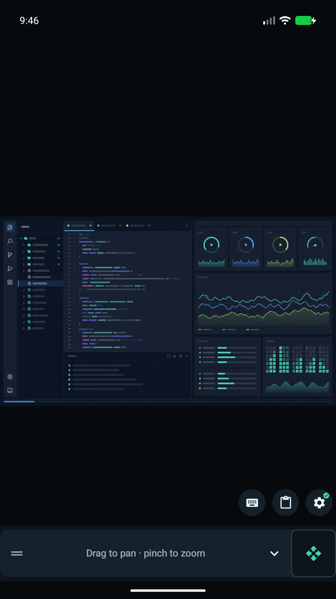
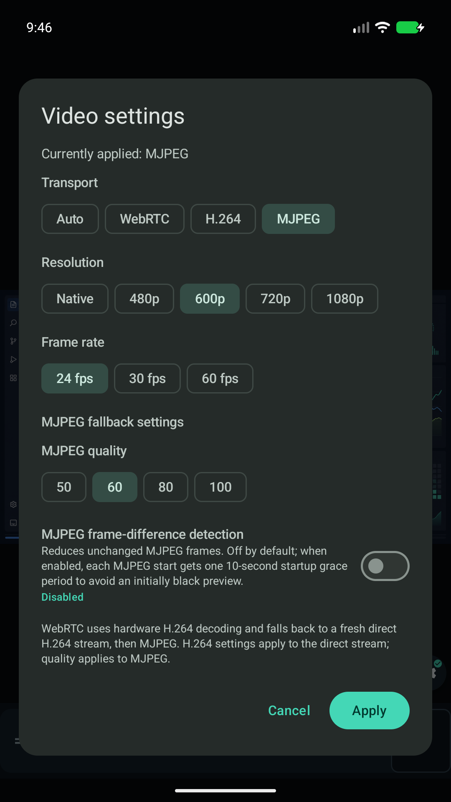

# NanoKVM Mobile

[](https://github.com/andrewginns/nanokvm-mobile/releases/latest)
[](LICENSE)
[](#requirements)

NanoKVM Mobile is an unofficial, open-source Android client for a trusted
[Sipeed NanoKVM](https://github.com/sipeed/NanoKVM). It provides a phone-friendly
remote console with direct touch, pan and zoom, Android keyboard input, video
controls, and appliance administration.

> [!IMPORTANT]
> This project is independent of Sipeed and is not an official NanoKVM app.
> It can control real keyboard, mouse, reset, power, network, and update
> operations. Review the target device before using guarded actions.



**[Download the latest signed APK](https://github.com/andrewginns/nanokvm-mobile/releases/latest)** |
**[Build from source](#build-from-source)** |
**[Report a problem](https://github.com/andrewginns/nanokvm-mobile/issues/new/choose)**

## Features

- Saved NanoKVM profiles with explicit HTTPS certificate review and per-device
  certificate pinning.
- Direct H.264 video with MJPEG fallback and optional WebRTC-first transport.
- Direct-touch, trackpad, and external mouse/keyboard input modes, including
  Android pointer capture where supported.
- Native Android keyboard input, special keys, and previewed phone clipboard or
  share-target text typing.
- Optional Android Keystore-protected passwords unlocked with biometrics or the
  device screen lock.
- Guarded power, reset, update, virtual-media, Wake-on-LAN, network, and device
  administration controls.
- Foreground-only terminal, script, shortcut, autostart, and PicoClaw tools on
  appliances that advertise those capabilities.
- Adaptive Material 3 layouts for compact phones, landscape, large screens,
  light/dark themes, and optional dynamic colour.

Capability coverage and appliance-specific behavior are documented in
[the parity ledger](docs/WEBUI_PARITY.md).

## Screenshots

<table>
  <tr>
    <td width="50%" align="center">
      <a href="docs/images/readme/connections.png"></a><br>
      <strong>Connections</strong>
    </td>
    <td width="50%" align="center">
      <a href="docs/images/readme/profile-editor.png"></a><br>
      <strong>Profile setup</strong>
    </td>
  </tr>
  <tr>
    <td width="50%" align="center">
      <a href="docs/images/readme/console.png"></a><br>
      <strong>Remote console</strong>
    </td>
    <td width="50%" align="center">
      <a href="docs/images/readme/video-settings.png"></a><br>
      <strong>Video settings</strong>
    </td>
  </tr>
</table>

<sub>These are captures of the real Compose UI using reserved example
addresses and a rights-clear synthetic remote framebuffer. No private device
data is shown.</sub>

## Requirements

- Android 8.0 (API 26) or newer.
- NanoKVM application 2.3.2 or newer, reachable over HTTPS on the local network.
- On Android 17 (API 37), grant **Local network** access when prompted.

The current stable APK has been used for several weeks without reported issues
against NanoKVM application 2.4.3. Hardware-dependent features remain
capability-gated and may not appear on every appliance.

Private and self-signed certificates are supported through explicit review and
per-profile pinning. The app does not install a global CA or use a global
trust-all transport.

## Install and update

1. Open the [latest GitHub release](https://github.com/andrewginns/nanokvm-mobile/releases/latest).
2. Download the `.apk` and its accompanying `SHA256SUMS` file.
3. Compare the APK checksum, then allow installation from your browser or file
   manager when Android asks. GitHub APK updates are manual.

Published APKs use the production signing certificate recorded on each release.
A development/debug APK cannot update a production-signed installation. Do not
uninstall merely to bypass a signature mismatch: uninstalling removes saved
profiles, certificate pins, and protected credentials.

The current production signing-certificate SHA-256 is:

```text
B8:C5:6C:A6:A2:29:C8:5C:D8:29:DA:21:CF:69:72:19:E2:D1:A1:D5:F9:4D:65:87:19:EB:FA:9E:90:90:75:FD
```

Release assets include the APK checksum, signer evidence, exact source archive,
dependency inventory, SBOM, licences, and notices. Maintainer signing and
provenance requirements are documented in [Distribution](docs/DISTRIBUTION.md).

## Quick start

1. Select **Add a NanoKVM profile**, then enter the device hostname or IP
   address, HTTPS port, and username.
2. Connect, review an untrusted private certificate if prompted, and enter the
   NanoKVM password. Saving it is always a separate opt-in choice.
3. Use the console's keyboard, clipboard typing, view pad, input mode, video,
   power, and **More actions** controls as needed.

## Known limitations

- Appliance and hardware-specific features are hidden, disabled, or read-only
  when the NanoKVM does not advertise the required capability.
- WebRTC is attempted first only when explicitly selected and may contact
  appliance-supplied ICE/STUN/TURN endpoints before falling back to H.264 or
  MJPEG.
- Phone clipboard and share-target text is typed as USB HID input; it is not a
  shared or bidirectional host clipboard.
- Horizontal scrolling uses Shift+wheel compatibility because NanoKVM exposes
  one wheel axis, so behavior depends on the remote operating system and app.
- Virtual-media URLs are fetched by the appliance, not downloaded to the phone.
- Terminals, scripts, updates, network changes, power controls, and PicoClaw can
  disrupt the appliance or controlled host and require deliberate confirmation.

## Build from source

Install Android Studio or JDK 21, Android SDK platform 37, and Android platform
tools. Configure the SDK through Android Studio, `ANDROID_HOME`, or a local
untracked `local.properties` file before building.

```shell
git clone https://github.com/andrewginns/nanokvm-mobile.git
cd nanokvm-mobile
```

Windows PowerShell:

```powershell
.\gradlew.bat --no-problems-report --dependency-verification=strict :app:assembleDebug
```

macOS or Linux:

```shell
./gradlew --no-problems-report --dependency-verification=strict :app:assembleDebug
```

The APK is written to `app/build/outputs/apk/debug/app-debug.apk`. It uses the
local machine's debug certificate and cannot update the published APK. Do not
share it as an update build.

The complete maintainer verification commands are in
[Build verification](docs/BUILD_VERIFICATION.md).

## Privacy, security, and support

NanoKVM Mobile has no developer-operated service, advertising, analytics,
telemetry, or automatic crash reporting. Profiles and protected credentials are
stored locally on the Android device; connections go to endpoints selected by
the user or supplied by the trusted NanoKVM during transport negotiation.

- Read the [privacy notice](PRIVACY.md), [security policy](SECURITY.md), and
  [security model](docs/SECURITY_MODEL.md).
- Report ordinary defects through
  [GitHub Issues](https://github.com/andrewginns/nanokvm-mobile/issues/new/choose).
- Report vulnerabilities privately through
  [GitHub Security Advisories](https://github.com/andrewginns/nanokvm-mobile/security/advisories/new).

Never include passwords, tokens, private hosts, certificate fingerprints,
terminal contents, or framebuffer data in a public report.

## Contributing and license

Issues and pull requests are welcome; see [Contributing](CONTRIBUTING.md).
User-visible changes are recorded in the [changelog](CHANGELOG.md).
NanoKVM Mobile is licensed under the
[GNU General Public License v3.0 or later](LICENSE).
